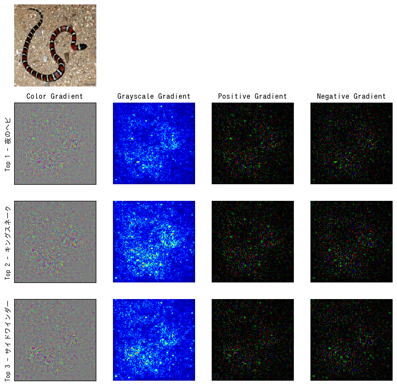
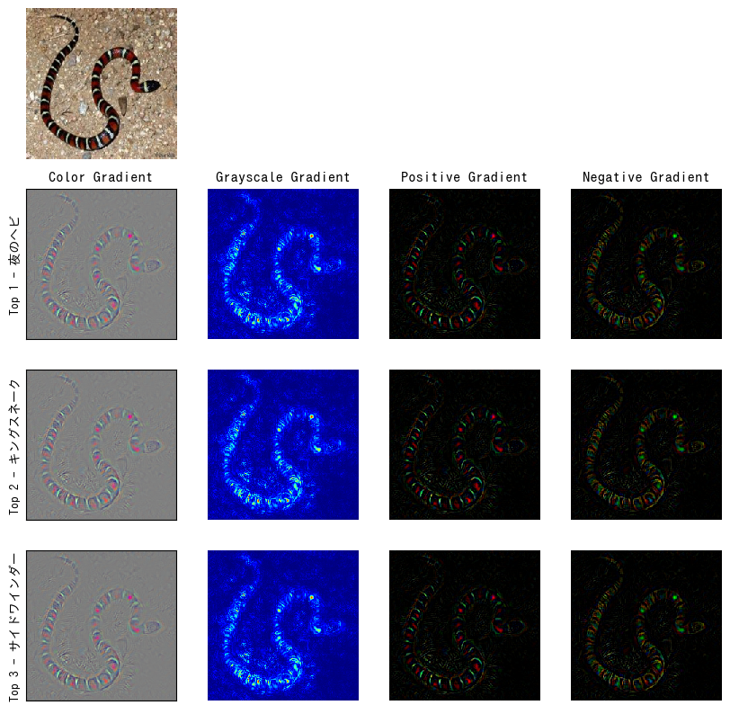
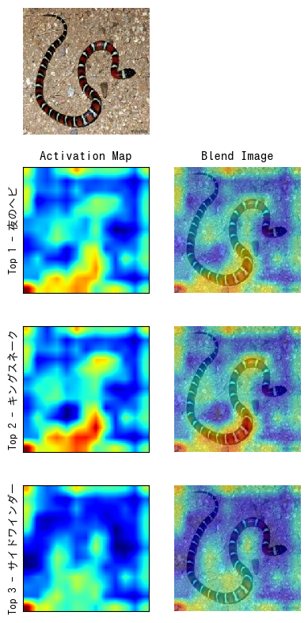
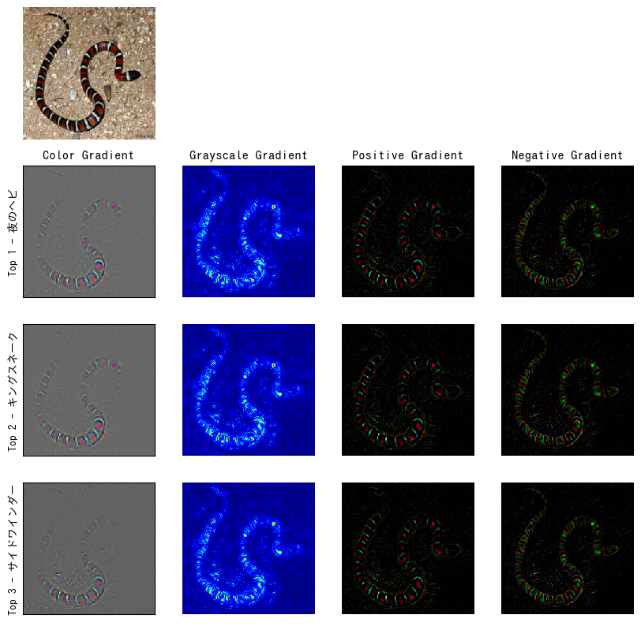

# pytorch-explainable-cnn

## Vanilla Backpropagation

```python
!python vanilla_backprop.py \
    --model alexnet \
    --input data \
    --output output \
    --gpu_id 0
```



## Guided Backpropagation

```python
!python guided_backprop.py \
    --model alexnet \
    --input data \
    --output output \
    --gpu_id 0
```



## GradCAM

```python
!python gradcam.py \
    --model alexnet \
    --input data \
    --output output \
    --target features.11 \
    --gpu_id 0
```



## Guided GradCAM

```python
!python guided_gradcam.py \
    --model alexnet \
    --input data \
    --output output \
    --target features.11 \
    --gpu_id 0
```

